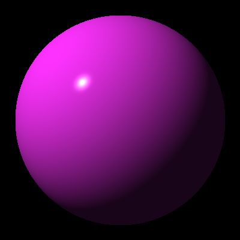
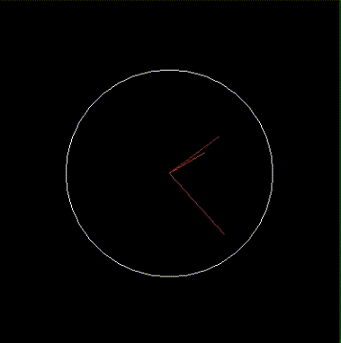

# RayTracer

Created this repo to follow along with the book "The Ray Tracer Challenge" by Jamis Buck

The following are demonstrations of the capabilities of the ray tracing engine:

|  |  |  |
|:--:|:--:|:--:|
| *Sphere rendered using Phong reflection model* | *Sheared circle* | *Clock displaying current time* |
